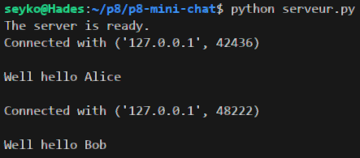
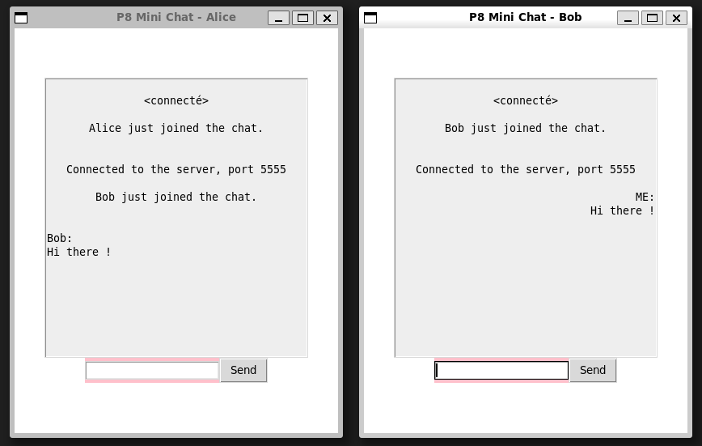
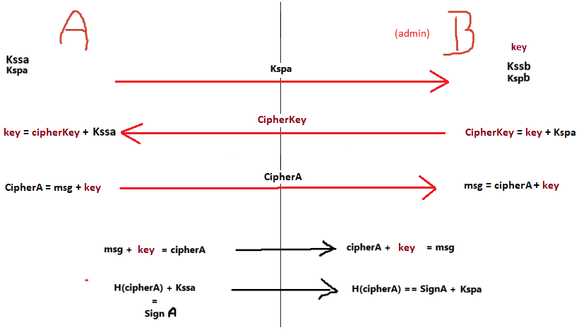

# Messagerie instantannée sécurisée

Implémentation d'un mini-chat minimaliste qui permet à un ensemble de personnes d'échanger des messages de manière sécurisée.

## Logiciels
Ce projet à été crée avec : <br>
- Python 3.10 <br>
- TKinter <br>

## Installation

Clonez le dépôt sur votre machine :

```
git clone git@code.up8.edu:fgodin/p8-mini-chat.git
```

## Utilisation

Pour démarrer le serveur, ouvrez un terminal et exécutez :

```
python3 serveur.py
```


Pour démarrer le client, ouvrez un ou plusieurs terminaux et exécutez :

```
python3 client.py
```

## Exemples



*Lancement du serveur depuis un terminal*

---



*Aperçu de deux interfaces de discussion simultanée entre deux utilisateurs Alice et Bob.*

## Contributeurs

[Anyce Ekomono](https://code.up8.edu/aekomono)  
[Dounia Hullot](https://code.up8.edu/dhullot)  
[François Godin](https://code.up8.edu/fgodin)  
[Maëva Himeur](https://code.up8.edu/mhimeur)  
[Neha Sougoumar](https://code.up8.edu/nsougoumar)  
[Valentin Guillon](https://code.up8.edu/Valentin_G)

## Ressources

### Documents

[Protocole détaillé](https://www.canva.com/design/DAGXBbY1c7I/5w7ta_j_Rz_1ke2YA1wvHw/edit)  
[Détail des consignes du projet](https://pads.up8.edu/rj6S3VS3R5W_QRial1zb7g#)

### Schémas
 


*Chiffrement entre deux clients*  
  
**Kss**    : Clé secrète signature  
**Ksp**    : Clé publique signature  
**H(...)** : Fonction de hachage pour RSA  
**key**    : Clé de chiffrement symétrique